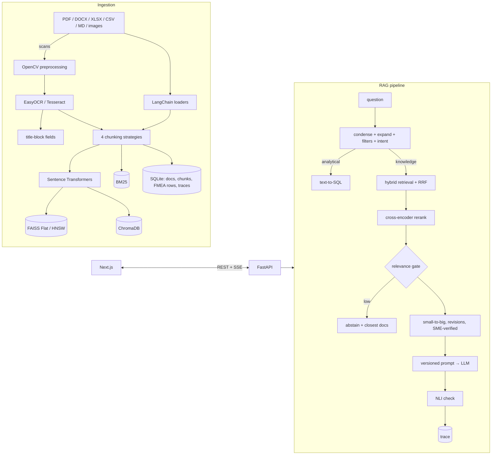

# Yokoten 横展 — AI knowledge copilot for engineering lessons learned

**Ask an automotive supplier's engineering record a question in plain English and get a cited answer — or an honest
"not in the knowledge base".** Hybrid semantic search, OCR for scanned drawings, an explainability trace for every
answer, and an evaluation harness with real, reproducible numbers.

*Yokoten (横展) is the Toyota Production System practice of spreading a lesson learned sideways to every team that
could hit the same problem.*

<!-- Demo GIF: record following docs/DEMO_SCRIPT.md and save as docs/demo.gif, then add:  -->

## Features

- **Chat with citations** — streaming answers, every sentence cited `[n]`; clicking a citation opens the source at the
  exact page with the passage highlighted (PDF pages rendered server-side, scans with OCR boxes).
- **Knows when it doesn't know** — a calibrated relevance gate abstains and shows the closest documents; a
  sentence-level NLI check underlines anything the sources do not support; confidence badge per answer.
- **Hybrid semantic search** — Sentence Transformers + BM25 fused with Reciprocal Rank Fusion, cross-encoder
  reranking, metadata facets (type, product line, component, project, year, plant), score breakdown.
- **Explainability trace** — rewritten query, extracted filters, intent, every retrieved chunk with dense / BM25 /
  RRF / rerank scores, prompt version, tokens and latency per stage.
- **Ingestion + image processing** — PDF, DOCX, XLSX, CSV, Markdown and images; OpenCV denoise → deskew →
  adaptive threshold → OCR, title-block fields (part number, revision, material) extracted into metadata, before/after
  viewer; figures in PDFs extracted with captions; revision-aware (prefers the latest revision, mentions superseded).
- **Onboarding digest** — pick a component and get recurring failure modes, lessons learned, must-read documents and
  an acronym glossary, with a cited LLM brief.
- **Text-to-SQL** for counting / ranking questions over structured FMEA and document tables (SQL shown in the trace).
- **Access control** — documents carry a classification; retrieval, search, SQL and the library respect the role.
- **SME verification loop** — quality experts verify or correct answers; verified answers are reused for similar
  questions; live feedback analytics.
- **Evaluation dashboard** — golden set of 129 questions, ablations, faithfulness, abstention, latency, OCR.
- **Runs on a CPU-only laptop**; LLM from Groq, Gemini, a local Ollama server or an in-process Hugging Face model.

## Architecture



More detail: [docs/ARCHITECTURE.md](docs/ARCHITECTURE.md) · decisions: [docs/DECISIONS.md](docs/DECISIONS.md).

## How it maps to the internship brief

Built for an internship on an AI chatbot for engineering knowledge management. The brief's goals, paraphrased:

| Goal (paraphrased) | Where it is proven |
|---|---|
| Prototype a chatbot that retrieves information from past engineering work | `/chat`: streaming, cited answers with a source viewer; `rag/pipeline.py` |
| Implement semantic search and knowledge retrieval | `/search`, hybrid dense + BM25 + reranker, metadata filters; `retrieval/index.py` |
| Test and validate response accuracy | golden set + ablations + NLI faithfulness + abstention; `/eval`, [EVALUATION_REPORT](docs/EVALUATION_REPORT.md) |
| Document findings and present outcomes | auto-generated report, [DEMO_SCRIPT](docs/DEMO_SCRIPT.md), [PRESENTATION_OUTLINE](docs/PRESENTATION_OUTLINE.md), [FUTURE_WORK](docs/FUTURE_WORK.md) |
| Python, image processing, ML/NLP, LLMs + prompt engineering, RAG, databases & IR | see the keyword table below |

## Keyword → code

| Keyword | Where it is used |
|---|---|
| RAG | `backend/yokoten/rag/pipeline.py` (retrieve → rerank → gate → context → prompt → LLM → NLI) |
| LangChain | `ingest/loaders.py` (`BaseLoader`), `ingest/chunking.py` (text splitters), `retrieval/index.py` (`BaseRetriever`), `rag/query.py` (`ChatPromptTemplate`), `rag/llm.py` (chat models + LCEL chains) |
| FAISS | `retrieval/index.py` — `IndexFlatIP`, `IndexHNSWFlat`, `IDSelectorBatch` metadata filtering |
| ChromaDB | `retrieval/index.py` — persistent collection, native `where` filters |
| Hugging Face Transformers | `rag/models.py` (NLI faithfulness, zero-shot intent), `ingest/entities.py` (NER), `rag/llm.py` (local LLM) |
| Sentence Transformers | `retrieval/embeddings.py` (bi-encoder), `rag/models.py` (`CrossEncoder` reranker) |
| Prompt Engineering | `backend/prompts/*.md` + [CHANGELOG](backend/prompts/CHANGELOG.md), compared in the eval |
| Semantic Search | `/api/search`, `frontend/src/app/search/page.tsx` |
| Vector Database | FAISS + ChromaDB behind one interface (`retrieval/index.py`) |
| NLP | NER, NLI, zero-shot classification, BM25 tokenisation, query condensing / acronym expansion (`rag/query.py`) |
| Image Processing (OpenCV + OCR) | `ingest/ocr.py` — denoise, projection-profile deskew, adaptive threshold, title-block parsing |
| Text-to-SQL | `rag/sql.py` (read-only, role-scoped views) |
| Evaluation | `evaluation/` — metrics, ablations, calibration, report |

## Results

<!-- results:start -->
Not yet measured — run `.\tasks.ps1 eval`.
<!-- results:end -->

## Quickstart

**Docker (one command, after creating `.env` from `.env.example`):**

```bash
docker compose up --build        # UI http://localhost:3000, API http://localhost:8000/docs
```

The backend generates the demo corpus and ingests it on first start.

**Local (Windows PowerShell):**

```powershell
.\tasks.ps1 setup     # uv sync + npm install
.\tasks.ps1 data      # generate the synthetic corpus + golden set (~30 s)
.\tasks.ps1 ingest    # parse, OCR, chunk, embed, index (~8 min first time on CPU)
.\tasks.ps1 dev       # API :8000 + UI :3000
.\tasks.ps1 eval      # full evaluation -> docs/EVALUATION_REPORT.md
.\tasks.ps1 public    # optional: NHTSA recalls as a second collection
```

**Local (macOS / Linux):** `cd backend && uv sync && uv run yokoten gen-data && uv run yokoten ingest && uv run uvicorn yokoten.api:app`, then `cd frontend && npm install && npm run dev`.

LLM keys go in `.env` (`GROQ_API_KEY`, `GOOGLE_API_KEY`); without keys the app uses a local Hugging Face model.

## Data

The corpus describes a **fictional** Tier-1 supplier, *Norvane Automotive Systems* — 231 generated documents
(8D reports, lessons learned, DFMEA/PFMEA, DVP&R, test reports, design reviews, ECNs, supplier quality reports, work
instructions, scanned drawings and inspection records), generated from 32 hand-written quality cases so that
cross-document questions have guaranteed answers. An optional second collection holds real **NHTSA recall**
campaigns (US Government data, public domain). No real company data is used.

## Limitations

- Synthetic corpus: absolute scores are optimistic; the ablations (relative comparisons) are the useful signal.
- Without an LLM API key the demo falls back to a 1.5B local model, which answers correctly but cites less reliably.
- OCR misses isolated single characters on some drawings (see the error analysis).

## Future work

See [docs/FUTURE_WORK.md](docs/FUTURE_WORK.md): PLM/DMS connectors, SSO and per-document ACLs, on-prem GPU serving,
feedback-driven improvement, multilingual documents.

## Author

Ashwani Yadav — B.Tech Mechanical Engineering (CS minor), DTU.
