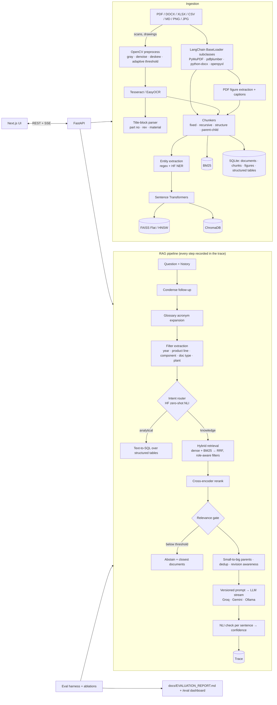

# Yokoten — Architecture

Yokoten is a retrieval-augmented copilot over a (synthetic) Tier-1 automotive supplier's engineering record:
lessons-learned reports, 8Ds, DFMEA/PFMEA sheets, DVP&R / test reports, design-review minutes, ECNs,
supplier-quality reports, work instructions, field-failure analyses and scanned drawings.

## System overview



## Folder structure

```
backend/                 FastAPI + pipeline (uv project, package `yokoten`)
  yokoten/
    config.py            .env settings, RuntimeConfig (switchable in UI / eval), device detection
    db.py                SQLModel tables (documents, chunks, traces, feedback, eval runs, structured tables)
    api.py               REST + SSE endpoints
    cli.py               `yokoten gen-data | ingest | ask | eval`
    datagen/             seeded synthetic corpus + golden set generator
    ingest/              loaders, OCR/image processing, chunking, entities, ingestion pipeline
    retrieval/           embeddings, FAISS/Chroma stores, BM25, RRF, reranker
    rag/                 LLM providers + cache, query understanding, NLI, pipeline, text-to-SQL
    evaluation/          metrics, harness, ablations, report generator
  prompts/               versioned prompt files + CHANGELOG.md
  tests/
frontend/                Next.js 16 + TypeScript + Tailwind v4 + shadcn/ui
data/                    glossary + generated corpus (data/corpus, gitignored, reproducible)
eval/                    golden.jsonl (dev/test split) + results/
docs/                    architecture, decisions, evaluation report, demo & interview assets
tasks.ps1                task runner (setup, data, ingest, dev, test, lint, eval)
```

## Tech choices (one line each)

| Concern | Choice | Why |
|---|---|---|
| API | FastAPI + native `EventSourceResponse` | typed REST + SSE streaming with OpenAPI docs for free |
| Orchestration | LangChain (loaders, splitters, retriever, prompts, LCEL chains, chat models) | provider abstraction and standard interfaces; no LangGraph: the pipeline is linear |
| Embeddings | Sentence Transformers `BAAI/bge-small-en-v1.5` (+ MiniLM-L6, bge-base in ablation) | strong quality for 33M params, CPU-friendly |
| Vector DB | FAISS (Flat / HNSW) and ChromaDB behind one interface | compare exact vs ANN vs a persisted DB with native metadata filters |
| Lexical | rank-bm25 + Reciprocal Rank Fusion | part numbers and codes need exact-match recall |
| Reranker | `cross-encoder/ms-marco-MiniLM-L6-v2` | big precision gain for ~20 ms per pair on CPU |
| NLI / intent | HF Transformers `cross-encoder/nli-deberta-v3-xsmall` | one small model does both sentence faithfulness and zero-shot intent |
| NER | HF `dslim/distilbert-NER` + regex | supplier/org names from free text; regex for part numbers and project codes |
| LLM | Groq (default), Gemini (fallback + judge), Ollama (local) | free tiers + an on-prem story; the judge is from a different family than the generator |
| Parsing | PyMuPDF, pdfplumber, python-docx, openpyxl/pandas | page-level bounding boxes for citation highlights |
| Image processing | OpenCV + Tesseract (EasyOCR fallback) | classic, explainable preprocessing |
| Storage | SQLite via SQLModel | zero-ops, Postgres-ready |
| Frontend | Next.js + shadcn/ui + Recharts | fast to build a polished, accessible UI |
| Source viewer | backend renders the PDF page to PNG with highlight boxes (PyMuPDF) | no pdf.js worker plumbing; works for every format |

## Phase plan

| Phase | Output |
|---|---|
| P0 Setup | scaffold, tooling, CI, Docker skeleton, health endpoint + UI shell |
| P1 Data | seeded corpus generator (~200 docs, 5 formats), manifest, golden set (~120 Q, dev/test) |
| P2 Ingestion | loaders, OCR pipeline, 4 chunkers, entities, embeddings, FAISS/Chroma/BM25, incremental re-index |
| P3 RAG core | full pipeline, providers + cache, citations, abstention, NLI, traces, SSE API, CLI |
| P4 Website | landing, chat, search, library, onboarding, eval, settings |
| P5 Evaluation | harness, ablations, dashboard, auto-generated report |
| P5b Public data | NHTSA recalls subset as a separate collection + small eval |
| P6 Next-level | K text-to-SQL → N access control → M SME verification loop |
| P7 Ship | docs/assets, one-command Docker run, deployment (after approval) |

## Components as built

| Module | Responsibility |
|---|---|
| `datagen/` | Seeded generator: 32 hand-written quality cases → 231 documents in 6 formats + `eval/golden.jsonl`; `public.py` converts NHTSA recalls into a second collection |
| `ingest/loaders.py` | `EngineeringDocLoader(BaseLoader)`: layout elements with page + bbox (PyMuPDF text/figures, pdfplumber tables, python-docx, openpyxl rows, Markdown, OCR lines) |
| `ingest/ocr.py` | OpenCV grayscale → fastNlMeans denoise → projection-profile deskew → adaptive threshold → Tesseract/EasyOCR; empty title-block cells re-read by the recogniser; field regexes |
| `ingest/chunking.py` | fixed / recursive / structure / parent-child via LangChain splitters, keeping locations |
| `ingest/entities.py` | regex (part numbers, projects, doc refs, lots), glossary (components, plants, doc types), HF NER organisations |
| `ingest/pipeline.py` | SHA-256 incremental ingestion, FMEA rows → SQL table, revision `is_latest` flags, ingestion report |
| `retrieval/embeddings.py` | Sentence Transformers with a per-model embedding cache |
| `retrieval/index.py` | FAISS Flat/HNSW + Chroma + BM25 + RRF behind one `Index`; `HybridRetriever(BaseRetriever)` |
| `rag/query.py` | versioned prompts → `ChatPromptTemplate`; condense (LCEL chain), glossary expansion, filter extraction |
| `rag/models.py` | cross-encoder reranker, NLI entailment, zero-shot intent (HF pipeline) |
| `rag/pipeline.py` | the answer flow with a timed trace; small-to-big, revision awareness, SME-verified sources, SQL route, NLI verification, confidence |
| `rag/sql.py` | text-to-SQL: LLM writes one SELECT, executed read-only against role-filtered TEMP views, 3 s timeout |
| `rag/verified.py` | SME-verified answers matched by embedding similarity and injected as a boosted source |
| `rag/llm.py` | Groq / Gemini / Ollama / local HF chat models, SQLite response cache, throttling, LCEL `chain()` |
| `rag/onboarding.py` | digest: issues, DFMEA priorities, lessons, must-read list, glossary + cited LLM brief |
| `evaluation/` | metrics, greedy one-variable ablations on dev, gate calibration, generation metrics (+ judge), OCR field accuracy, report + README results |
| `api.py` | REST + SSE; role header (`X-Role`), demo-mode rate limit and read-only switch, upload limits, first-start bootstrap |

## Security notes
- Retrieved text is data, not instructions: the answer prompt says so explicitly and passages are fenced as numbered context.
- Uploads: extension allow-list, size limit (`MAX_UPLOAD_MB`), stored outside the web root under generated names.
- Text-to-SQL: `mode=ro` SQLite connection, statement allow-list (single SELECT/WITH), role-filtered views, row cap, time limit.
- Demo mode (`DEMO_MODE=true`): uploads, deletes, re-index, settings and verification are disabled; POSTs rate-limited per IP.
- Secrets only in `.env`; the confidential brief files are gitignored.
