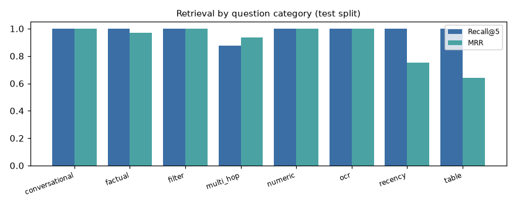
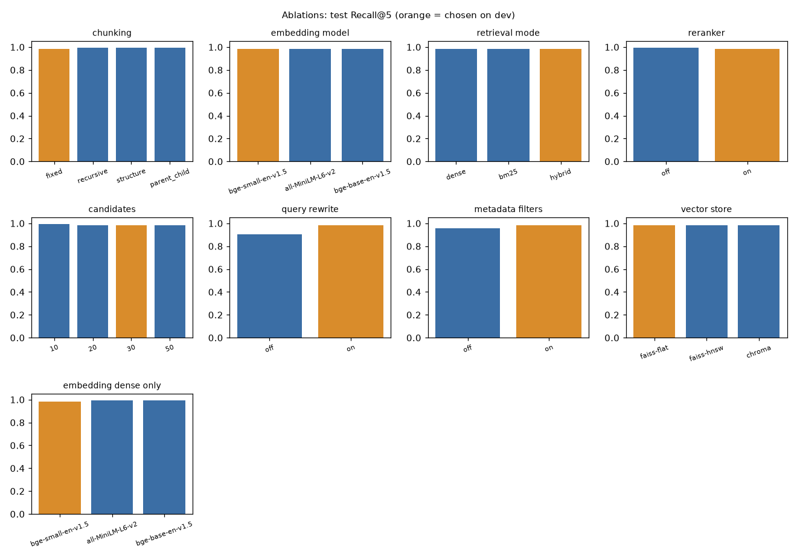
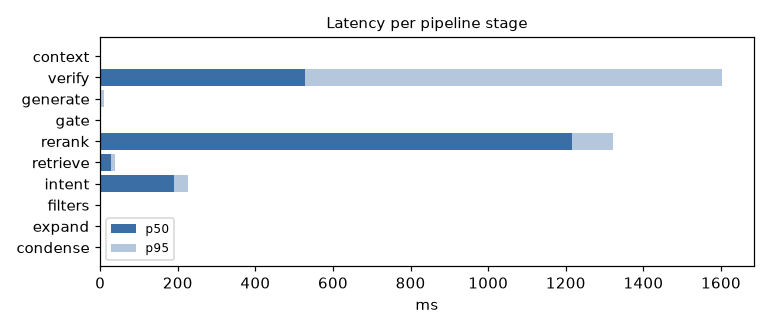

# Evaluation report

*Auto-generated by `yokoten eval` - run `20260930-031702` (2026-09-30T03:17:02 UTC, 27 min). Reproduce: `.\tasks.ps1 eval`. Raw results: `eval/results/20260930-031702.json`.*

## 1. Setup

- **Corpus:** 1731 synthetic documents of the fictional supplier Norvane Automotive Systems (105 pdf, 1526 md, 51 docx, 31 xlsx, 10 png, 8 jpg); 3750 indexed chunks with the chosen chunking.
- **Golden set:** 129 questions derived from the generator's ground truth (dev 51 for tuning, test 78 for every number below).
- **Hardware:** AMD64 Family 25 Model 116 Stepping 1, AuthenticAMD, device `cpu`.
- **Models:** embeddings `BAAI/bge-small-en-v1.5`, reranker `cross-encoder/ms-marco-MiniLM-L6-v2`, NLI `cross-encoder/nli-deberta-v3-xsmall`, generator `local/Qwen/Qwen2.5-1.5B-Instruct`, judge `none available (no second provider key)`.

| Category | dev | test |
|---|---|---|
| analytical | 3 | 5 |
| conversational | 4 | 6 |
| factual | 10 | 16 |
| filter | 4 | 6 |
| multi_hop | 6 | 8 |
| numeric | 5 | 7 |
| ocr | 5 | 8 |
| recency | 2 | 4 |
| table | 4 | 6 |
| unanswerable | 8 | 12 |

## 2. Headline (test split)

| Metric | Value | Definition |
|---|---|---|
| Retrieval Recall@5 | 98.4% | Share of question hops whose gold document is in the top 5 (test split) |
| MRR | 93.2% | Mean reciprocal rank of the first gold doc |
| Answer correctness | 71.5% | Share of reference facts present in the answer (answerable test questions) |
| Faithfulness (NLI) | 48.0% | Share of answer sentences entailed by the cited passages |
| Abstention recall | 50.0% | Unanswerable questions correctly declined |
| Hallucination rate | 52.6% | Answered questions with at least one unsupported sentence (or answering an unanswerable one) |
| Retrieval p50 latency | 1.40 s | Query understanding + hybrid retrieval + rerank, CPU |
| Answer p50 latency | 1.96 s | End-to-end with local/Qwen/Qwen2.5-1.5B-Instruct |

## 3. Retrieval

Metrics are document-level: a question's gold is a list of hops, each hop a set of acceptable documents. Recall@k = share of hops with a gold document in the top k; MRR uses the first gold document; nDCG@10 credits each hop once.

| Metric | Test |
|---|---|
| recall@1 | 75.3% |
| recall@3 | 98.0% |
| recall@5 | 98.4% |
| recall@10 | 100.0% |
| mrr | 93.2% |
| ndcg@10 | 94.3% |
| n | 61 |

| Category | n | R@1 | R@5 | R@10 | MRR | nDCG@10 |
|---|---|---|---|---|---|---|
| conversational | 6 | 100.0% | 100.0% | 100.0% | 1.000 | 1.000 |
| factual | 16 | 93.8% | 100.0% | 100.0% | 0.969 | 0.977 |
| filter | 6 | 40.3% | 100.0% | 100.0% | 1.000 | 1.000 |
| multi_hop | 8 | 43.8% | 87.5% | 100.0% | 0.938 | 0.908 |
| numeric | 7 | 100.0% | 100.0% | 100.0% | 1.000 | 1.000 |
| ocr | 8 | 100.0% | 100.0% | 100.0% | 1.000 | 1.000 |
| recency | 4 | 50.0% | 100.0% | 100.0% | 0.750 | 0.815 |
| table | 6 | 33.3% | 100.0% | 100.0% | 0.639 | 0.732 |



## 4. Ablations (one variable at a time)

Each group changes one setting while the rest stay at the best configuration found so far. The variant with the best dev Recall@5 + MRR is kept (ties keep the current setting); test numbers are reported. No LLM calls are involved (conversational questions use the history heuristic).

### chunking

| Variant | dev R@5 | dev MRR | test R@5 | test R@10 | test MRR | test nDCG@10 | p50 ms |
|---|---|---|---|---|---|---|---|
| **fixed** (chosen) | 96.2% | 0.947 | 98.4% | 100.0% | 0.932 | 0.943 | 1449 |
| recursive | 95.0% | 0.945 | 99.2% | 100.0% | 0.940 | 0.949 | 1354 |
| structure | 95.0% | 0.900 | 99.2% | 99.2% | 0.929 | 0.941 | 777 |
| parent_child | 95.0% | 0.900 | 99.2% | 99.2% | 0.928 | 0.940 | 750 |

### embedding model

| Variant | dev R@5 | dev MRR | test R@5 | test R@10 | test MRR | test nDCG@10 | p50 ms |
|---|---|---|---|---|---|---|---|
| **bge-small-en-v1.5** (chosen) | 96.2% | 0.947 | 98.4% | 100.0% | 0.932 | 0.943 | 1449 |
| all-MiniLM-L6-v2 | 96.2% | 0.947 | 98.4% | 100.0% | 0.932 | 0.944 | 1476 |
| bge-base-en-v1.5 | 96.2% | 0.947 | 98.4% | 100.0% | 0.932 | 0.943 | 1511 |

### retrieval mode

| Variant | dev R@5 | dev MRR | test R@5 | test R@10 | test MRR | test nDCG@10 | p50 ms |
|---|---|---|---|---|---|---|---|
| dense | 96.2% | 0.947 | 98.4% | 100.0% | 0.932 | 0.943 | 1489 |
| bm25 | 96.2% | 0.947 | 98.4% | 100.0% | 0.932 | 0.944 | 1453 |
| **hybrid** (chosen) | 96.2% | 0.947 | 98.4% | 100.0% | 0.932 | 0.943 | 1449 |

### reranker

| Variant | dev R@5 | dev MRR | test R@5 | test R@10 | test MRR | test nDCG@10 | p50 ms |
|---|---|---|---|---|---|---|---|
| off | 95.0% | 0.907 | 99.2% | 100.0% | 0.922 | 0.937 | 243 |
| **on** (chosen) | 96.2% | 0.947 | 98.4% | 100.0% | 0.932 | 0.943 | 1449 |

### candidates

| Variant | dev R@5 | dev MRR | test R@5 | test R@10 | test MRR | test nDCG@10 | p50 ms |
|---|---|---|---|---|---|---|---|
| 10 | 95.0% | 0.941 | 99.2% | 99.2% | 0.932 | 0.940 | 576 |
| 20 | 96.2% | 0.947 | 98.4% | 100.0% | 0.932 | 0.944 | 974 |
| **30** (chosen) | 96.2% | 0.947 | 98.4% | 100.0% | 0.932 | 0.943 | 1449 |
| 50 | 96.2% | 0.947 | 98.4% | 100.0% | 0.932 | 0.943 | 1977 |

### query rewrite

| Variant | dev R@5 | dev MRR | test R@5 | test R@10 | test MRR | test nDCG@10 | p50 ms |
|---|---|---|---|---|---|---|---|
| off | 91.2% | 0.858 | 90.2% | 91.8% | 0.837 | 0.851 | 1364 |
| **on** (chosen) | 96.2% | 0.947 | 98.4% | 100.0% | 0.932 | 0.943 | 1449 |

### metadata filters

| Variant | dev R@5 | dev MRR | test R@5 | test R@10 | test MRR | test nDCG@10 | p50 ms |
|---|---|---|---|---|---|---|---|
| off | 96.2% | 0.934 | 95.9% | 100.0% | 0.883 | 0.904 | 1351 |
| **on** (chosen) | 96.2% | 0.947 | 98.4% | 100.0% | 0.932 | 0.943 | 1449 |

### vector store

| Variant | dev R@5 | dev MRR | test R@5 | test R@10 | test MRR | test nDCG@10 | p50 ms |
|---|---|---|---|---|---|---|---|
| **faiss-flat** (chosen) | 96.2% | 0.947 | 98.4% | 100.0% | 0.932 | 0.943 | 1449 |
| faiss-hnsw | 96.2% | 0.947 | 98.4% | 100.0% | 0.932 | 0.943 | 1396 |
| chroma | 96.2% | 0.947 | 98.4% | 100.0% | 0.932 | 0.943 | 1444 |

### embedding dense only

| Variant | dev R@5 | dev MRR | test R@5 | test R@10 | test MRR | test nDCG@10 | p50 ms |
|---|---|---|---|---|---|---|---|
| **bge-small-en-v1.5** (chosen) | 93.8% | 0.901 | 98.4% | 99.2% | 0.921 | 0.932 | 219 |
| all-MiniLM-L6-v2 | 95.0% | 0.854 | 99.2% | 100.0% | 0.852 | 0.886 | 210 |
| bge-base-en-v1.5 | 95.0% | 0.906 | 99.2% | 99.2% | 0.929 | 0.937 | 251 |



## 5. Abstention calibration

The relevance gate abstains when the best reranked passage scores below a threshold. A wrong refusal is a hard failure, while an unanswerable question that passes the gate still meets the prompt's own abstention rule, so the threshold is calibrated on dev to keep at least 97.5% of answerable questions and, within that, catch as many unanswerable ones as possible: **0.1073** (dev: answerable kept 100.0%, unanswerable caught 62.5%). On test the gate alone reaches abstention precision 75.0% and recall 50.0%; the LLM's own abstention adds to this (section 6). Maximising abstention F1 instead chose 0.856 on dev, which would have refused 7 answerable test questions scoring 0.50-0.83 - an example of over-fitting a threshold to 8 dev examples.

## 6. Generation

40 test questions (stratified by category) per configuration.

| Configuration | n | correctness | judge correctness | faithfulness | citation precision | cited answers | hallucination rate | abstention precision | abstention recall | latency p50 ms | input tokens | output tokens |
|---|---|---|---|---|---|---|---|---|---|---|---|---|
| chosen + prompt v2<br>`local/Qwen/Qwen2.5-1.5B-Instruct` | 40 | 71.5% | — | 48.0% | 100.0% | 73.7% | 52.6% | 100.0% | 50.0% | 1960 | 1245 | 42 |
| chosen + prompt v1<br>`local/Qwen/Qwen2.5-1.5B-Instruct` | 40 | 66.0% | — | 46.9% | 0.0% | 5.4% | 64.9% | 100.0% | 75.0% | 1888 | 976 | 55 |
| naive RAG (dense, no rerank, no rewrite)<br>`local/Qwen/Qwen2.5-1.5B-Instruct` | 40 | 56.7% | — | 50.8% | 0.0% | 7.7% | 59.0% | 100.0% | 25.0% | 1138 | 1045 | 58 |

Definitions: correctness = share of reference facts present in the answer (answerable questions); judge = LLM-as-judge score from a different model family (if available); faithfulness = share of answer sentences entailed by their cited passages (NLI); citation precision = share of citations whose passage entails the sentence; hallucination rate = answered questions with at least one unsupported sentence or an answer to an unanswerable question.

| Category | chosen + prompt v2 | chosen + prompt v1 | naive RAG (dense, no rerank, no rewrite) |
|---|---|---|---|
| analytical | 100.0% | 100.0% | 100.0% |
| conversational | 75.0% | 87.5% | 0.0% |
| factual | 87.5% | 100.0% | 100.0% |
| filter | 68.8% | 25.0% | 35.4% |
| multi_hop | 62.5% | 62.5% | 25.0% |
| numeric | 75.0% | 75.0% | 75.0% |
| ocr | 75.0% | 50.0% | 50.0% |
| recency | 62.5% | 62.5% | 62.5% |
| table | 37.5% | 31.2% | 62.5% |
| unanswerable | 50.0% | 75.0% | 25.0% |

## 7. Latency, tokens and index

| Stage | p50 ms | p95 ms |
|---|---|---|
| condense | 0 | 0 |
| expand | 0 | 0 |
| filters | 0 | 0 |
| intent | 190 | 226 |
| retrieve | 27 | 37 |
| rerank | 1215 | 1321 |
| gate | 0 | 0 |
| generate | 1 | 9 |
| verify | 528 | 1604 |
| context | 2 | 2 |



Tokens per answer (chosen config): input 1245, output 42.

| Index | Value |
|---|---|
| chunks indexed | 526 |
| embedding dim | 384 |
| embed all chunks s | 0.05 |
| faiss flat build s | 0.004 |
| faiss hnsw build s | 0.061 |
| faiss flat mb | 0.81 |
| faiss hnsw mb | 0.95 |
| chroma mb | 40.68 |
| bm25 build s | 0.07 |

## 8. OCR

Field accuracy on the 18 scans vs generator ground truth (part no, revision, material, lot, decision, measured values).

| Engine / setting | Field accuracy | Mean confidence | Seconds per page |
|---|---|---|---|
| easyocr | 86.4% | 89.1% | 15.7 |
| easyocr (no preprocessing) | 78.4% | 90.2% | 15.3 |

## 6b. Text-to-SQL routing for analytical questions

Counting / ranking questions answered from the structured tables (document metadata + FMEA rows) instead of top-k passages; the generated SQL is shown in the trace.

| Route | n | Correctness |
|---|---|---|
| sql on | 8 | 62.5% |
| sql off | 8 | 12.5% |

## 8b. Public NHTSA recalls collection

20 questions over a separate collection of real NHTSA recall campaigns (US Government data, public domain; filtered to 2021+ campaigns for cooling, fuel, power-train, electrical, steering and wiper systems). Headline numbers above use only the synthetic golden set.

| Category | n | R@1 | R@5 | MRR |
|---|---|---|---|---|
| public_lookup | 10 | 20.0% | 40.0% | 0.336 |
| public_semantic | 10 | 40.0% | 100.0% | 0.658 |

## 9. Error analysis

Real failures of the chosen configuration on the test split; the reason is derived from the run's retrieval ranks, gate scores, missing facts and NLI flags.

**Q088 (filter)** - Which 8D reports were opened at the Krakow Plant in 2023?

- Expected: Scroll wear from poor oil return at low refrigerant charge (8D-CMP-23-002); Hall sensor damage from load-dump transients (8D-EPS-23-004); Blower whine at speed 3 caused by housing resonance (8D-HVC-23-005); Intermittent EGT signal from fretting corrosion of tin-plated terminals (8D-SNS-23-009)
- Got: The 8D reports opened at the Krakow Plant in 2023 were:  - 8D-EPS-23-004 Rev A (Hall sensor damage from load-dump transients) - 8D-CMP-23-002 Rev A (Scroll wear from poor oil return at low refrigerant charge) - 8D-HVC-23-005 Rev A (Blower whine at speed 3 caused by housing resonance)  These reports cover issues related to Hall sensors, compressor components, and blower housings, respectively.
- Why: Gold document retrieved (rank 1), but the answer lacks: fretting. NLI flagged 4 unsupported sentence(s).

**Q050 (multi_hop)** - What was the annual PPM in 2024 of the supplier involved in the EPS bearing noise?

- Expected: Castell Bearings: 351 PPM in 2024.
- Got: The annual PPM in 2024 of the supplier involved in the EPS bearing noise was 351. [4]
- Why: Gold document retrieved (rank 1), but the answer lacks: Castell. NLI flagged 1 unsupported sentence(s).

**Q039 (table)** - What severity, occurrence and detection ratings does the wiper motor DFMEA give the failure mode 'Brush wear', and what is its action priority?

- Expected: S=6, O=3, D=5, action priority L.
- Got: The wiper motor DFMEA gives the failure mode 'Brush wear' a severity rating of 6, an occurrence rating of 6, and a detection rating of 5. Its recommended action priority is L. [1]
- Why: Gold document retrieved (rank 2), but the answer lacks: 3, low|AP L|AP: L|(L). NLI flagged 2 unsupported sentence(s).

**Q110 (unanswerable)** - What was the root cause of the headlamp condensation issue on project P-RAD-2101?

- Expected: The knowledge base does not contain this information.
- Got: The root cause of the headlamp condensation issue on project P-RAD-2101 was identified as an incorrect seal between the lamp housing and the reflector. This led to water ingress into the headlight assembly, causing condensation issues. [1]
- Why: Answered a question whose answer is not in the corpus: relevance gate score 0.14 passed the 0.11 threshold because related documents exist (LL-RAD-22-008, 8D-RAD-22-008); the LLM then composed an answer from them.

**Q078 (conversational)** - What was the permanent fix?

- Expected: 5 mm keep-out from the break line, soft-termination MLCCs from Qiantai Ceramics, and router depaneling instead of the pizza cutter.
- Got: The permanent fix included:  - Implementing a 5 mm keep-out zone around the break line. - Using soft-terminated MLCCs from Qiantai Ceramics. - Switching to router depaneling instead of the pizza cutter. - Updating the DFMEA for the failure mode 'MLCC short circuit' to reflect the new findings and recommendations.  These measures were implemented after verifying the effectiveness through tests such
- Why: Gold document retrieved (rank 1), but the answer lacks: soft-termination. NLI flagged 2 unsupported sentence(s).

**Q003 (factual)** - What was the root cause of the radiator tube-to-header coolant leak on project P-RAD-2101?

- Expected: Brazing voids at the tube-to-header joint. The controlled-atmosphere brazing furnace belt speed had been raised from 0.9 m/min to 1.2 m/min to gain throughput, which shortened time above flux melting temperature and left insufficient fillet formation. The change was not reviewed in the PFMEA.
- Got: The root cause of the radiator tube-to-header coolant leak on project P-RAD-2101 was brazing voids at the tube-to-header joint. [1]
- Why: Gold document retrieved (rank 1), but the answer lacks: belt speed. NLI flagged 1 unsupported sentence(s).

**Q031 (numeric)** - What was the actuator torque margin before the HVAC blend door stall fix?

- Expected: 1.1x
- Got: Before the HVAC blend door stall fix, the actuator's torque margin at -40°C was 1.1x. [1]
- Why: Gold document retrieved (rank 1), but the answer lacks: 1.1. NLI flagged 1 unsupported sentence(s).

**Q099 (recency)** - What is the current occurrence rating for die-attach solder fatigue in the traction inverter DFMEA?

- Expected: 2 (Rev D; it was 5 in Rev C).
- Got: The current occurrence rating for die-attach solder fatigue in the traction inverter DFMEA is 4.
- Why: Gold document retrieved (rank 2), but the answer lacks: 2. NLI flagged 1 unsupported sentence(s).

## 10. Chosen configuration and why

```json
{
  "llm_provider": "groq",
  "llm_model": "",
  "embedding_model": "BAAI/bge-small-en-v1.5",
  "chunking": "fixed",
  "vector_store": "faiss",
  "faiss_index": "flat",
  "retrieval_mode": "hybrid",
  "reranker": true,
  "top_k": 6,
  "candidates": 30,
  "query_rewrite": true,
  "use_filters": true,
  "prompt_version": "v2",
  "abstain_threshold": 0.1073,
  "abstain_threshold_dense": 0.55,
  "collections": [
    "engineering"
  ],
  "sql_route": true,
  "use_verified": false,
  "verified_similarity": 0.88
}
```

- **chunking = fixed** — best on dev; on test Recall@5 98.4% vs 99.2% for `structure` (Δ -0.8 pts, MRR Δ +0.3 pts), p50 1449 ms.
- **embedding model = bge-small-en-v1.5** — best on dev; on test Recall@5 98.4% vs 98.4% for `bge-small-en-v1.5` (Δ +0.0 pts, MRR Δ +0.0 pts), p50 1449 ms.
- **retrieval mode = hybrid** — best on dev; on test Recall@5 98.4% vs 98.4% for `dense` (Δ +0.0 pts, MRR Δ +0.0 pts), p50 1449 ms.
- **reranker = on** — best on dev; on test Recall@5 98.4% vs 99.2% for `off` (Δ -0.8 pts, MRR Δ +1.0 pts), p50 1449 ms.
- **candidates = 30** — best on dev; on test Recall@5 98.4% vs 99.2% for `10` (Δ -0.8 pts, MRR Δ +0.0 pts), p50 1449 ms.
- **query rewrite = on** — best on dev; on test Recall@5 98.4% vs 90.2% for `off` (Δ +8.2 pts, MRR Δ +9.4 pts), p50 1449 ms.
- **metadata filters = on** — best on dev; on test Recall@5 98.4% vs 95.9% for `off` (Δ +2.5 pts, MRR Δ +4.8 pts), p50 1449 ms.
- **vector store = faiss-flat** — best on dev; on test Recall@5 98.4% vs 98.4% for `faiss-flat` (Δ +0.0 pts, MRR Δ +0.0 pts), p50 1449 ms.

## 11. Recommendations

- Keep hybrid retrieval: BM25 adds exact matching of part numbers, lots and document IDs (+0.0 pts Recall@5 vs dense-only on test).
- Keep the cross-encoder reranker (+1.0 pts MRR) - it also provides the calibrated relevance score that drives abstention.
- At this corpus size exact FAISS Flat search costs nothing; HNSW changed Recall@5 by +0.0 pts. Switch to HNSW (or Chroma) once the index passes ~1M chunks.
- Weakest retrieval category: **multi_hop** (Recall@5 87.5%). Add a second retrieval round seeded with entities (supplier, ECN) from the first hop.
- Weakest retrieval category: **factual** (Recall@5 100.0%). Add targeted synonyms to the glossary for this question type.
- Only 73.7% of answers carried citations with Qwen/Qwen2.5-1.5B-Instruct; use a stronger instruction-following model (Groq Llama-3.3-70B or a 7-8B Ollama model) for production - citations are what make answers auditable.
- Hallucination rate is above 20%: block or flag answers whose NLI-unsupported sentence share exceeds a threshold, and show the unsupported sentences to the user (already underlined in the UI).
- OCR: best setting is **easyocr** with 86.4% field accuracy; keep OpenCV preprocessing in the pipeline and route low-confidence scans to human review.

## 12. Limitations

- The corpus is synthetic: documents are consistent and well-formed, so absolute numbers are optimistic compared with a real document management system; relative comparisons (ablations) are the useful signal.
- The golden set has 129 questions; per-category test numbers rest on 4-16 questions each.
- Correctness uses fact matching; paraphrased numbers or units can be scored as misses. The LLM judge runs only when a second provider key is configured.
- NLI faithfulness uses a 22M-parameter model; it is a strong filter for fabricated facts but can miss subtle numeric errors.
